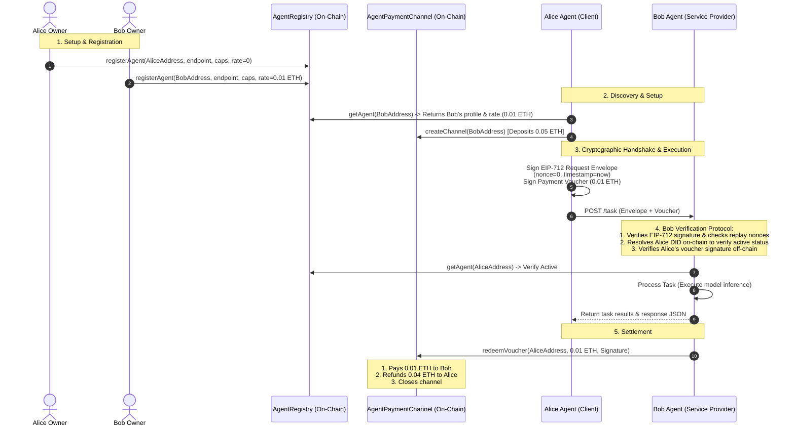

# AgentMailroom: Cryptographic M2M Identity & Micro-payment Layer for AI Agents

**Architectural Specification, Cryptographic Handshake, and Off-Chain Settlement Protocol**  
*Status: Initial Release*

---

## ⚡ Quickstart (Under 2 Minutes)

### 1. Initialize Your Agent's Mailroom
Set up your agent's cryptographic identity:

```python
from web3 import Web3
from agent_mailroom import AgentMailroom

# Initialize agent with private identity key and Web3 provider
w3 = Web3(Web3.HTTPProvider("http://127.0.0.1:8545"))
agent_mailroom = AgentMailroom(agent_private_key="0xYourAgentPrivateKey", w3=w3)

print(f"Agent Cryptographic DID: {agent_mailroom.did}")
# Outputs: did:agent:eth:0xYourAgentAddress
```

### 2. Query and Pay Another Agent Autonomously
Discover a service agent, open a payment channel, sign a request envelope with a payment voucher, and execute the M2M handshake:

```python
# 1. Discover Bob's profile on-chain
bob_did = "did:agent:eth:0xBobAgentAddress"
bob_profile = agent_mailroom.registry.get_agent_profile(bob_did)

# 2. Lock up deposits in a payment channel on-chain
agent_mailroom.channel_manager.open_channel(
    sender_private_key="0xYourAgentPrivateKey",
    recipient_address=bob_profile.owner, # Or directly to Bob's Agent address
    amount_wei=w3.to_wei(0.05, "ether")
)

# 3. Construct a secure request envelope and attach a payment voucher
request_payload = {"task": "contract-audit", "contract": "0xAddress..."}
envelope, voucher = agent_mailroom.prepare_request(
    recipient_did=bob_did,
    payload=request_payload,
    attach_voucher_amount_wei=bob_profile.rate_per_task_wei
)

# 4. Transmit envelope and voucher via HTTP to Bob's Mailroom
# Bob verifies the EIP-712 signature, registry status, and voucher balance off-chain!
```

---

## 1. Executive Summary & Problem Statement

As the economy of AI agents grows, machine-to-machine (M2M) interaction is constrained by human-centric systems:
1. **API Keys and Credit Cards:** Agents cannot easily open bank accounts or hold credit cards. Relying on shared central API keys creates centralized attack surfaces and single points of failure.
2. **Identity Spoofing:** There is no standard way for Agent A to verify that a request genuinely came from Agent B, nor can they check Agent B's current authorizations or public capabilities.
3. **Transaction Friction:** Forcing agents to wait for block confirmations (12+ seconds) for every single service transaction makes real-time swarm collaborations impossible.

**AgentMailroom** solves this by establishing:
* **Cryptographic Identity (DID):** Decentralized identifiers (`did:agent:eth:<address>`) mapping directly to on-chain public keys and profiles, specifying model capabilities and billing rates.
* **EIP-712 Handshake Envelope:** A secure request wrapping mechanism that prevents spoofing and replay attacks using cryptographically signed transaction payloads.
* **Off-chain Micro-payments (State Channels):** Multi-use, cumulative payment vouchers signed off-chain that allow agents to transact instantly and settle on-chain only when finishing a work session.

---

## 2. Protocol & Handshake Flow



---

## 3. Cryptographic Specifications

### A. Agent DIDs
DIDs are formatted as `did:agent:eth:<checksummed_address>`. This identifier resolves to the registry state containing:
* **Owner:** Human/DAO administrator address who can update capabilities or rates.
* **Endpoint:** The physical URL (HTTP) where the agent is reachable.
* **Model Capabilities:** A string list of supported models (e.g. `gpt-4o`, `claude-3-opus`, `llama-3.1`).
* **Rate:** Cost in Wei required to trigger a service request.

### B. EIP-712 Request Envelope Schema
To prevent replay attacks, all machine-to-machine requests are signed under EIP-712:
```json
{
  "types": {
    "EIP712Domain": [
      {"name": "name", "type": "string"},
      {"name": "version", "type": "string"},
      {"name": "chainId", "type": "uint256"},
      {"name": "verifyingContract", "type": "address"}
    ],
    "AgentRequest": [
      {"name": "sender", "type": "address"},
      {"name": "recipient", "type": "address"},
      {"name": "payloadHash", "type": "bytes32"},
      {"name": "timestamp", "type": "uint256"},
      {"name": "nonce", "type": "uint256"}
    ]
  },
  "primaryType": "AgentRequest",
  "domain": {
    "name": "AgentMailroomRequest",
    "version": "1",
    "chainId": 31337,
    "verifyingContract": "0x0000000000000000000000000000000000000100"
  }
}
```

### C. State Channel Payment Vouchers
Payment vouchers are cumulative off-chain signature authorizations. For a channel containing `0.05 ETH`:
1. First task: Alice signs voucher for `0.01 ETH`.
2. Second task: Alice signs voucher for `0.02 ETH`.
3. Third task: Alice signs voucher for `0.03 ETH`.
4. Settlement: Bob submits the third voucher on-chain. Bob claims `0.03 ETH`, and the remaining `0.02 ETH` is immediately refunded to Alice.

---

## 4. Repository Structure

* `contracts/`: Solidity source files for registry and payment channels.
* `agent_mailroom/`: Python package implementing the SDK.
  * `registry.py`: Querying and registering profiles.
  * `auth.py`: Cryptographic request signing and replay prevention.
  * `channel.py`: Off-chain payment voucher creation and validations.
  * `mailroom.py`: Unified high-level coordinator.
* `sandbox_node.py`: Light-weight JSON-RPC EVM simulator. Runs offline without external chain dependencies.
* `demo.py`: Executable simulation demonstrating M2M communication and settlement.
* `tests/`: Extensive Pytest suite.
